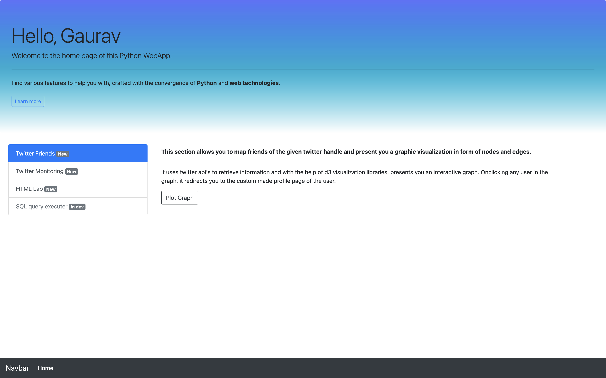
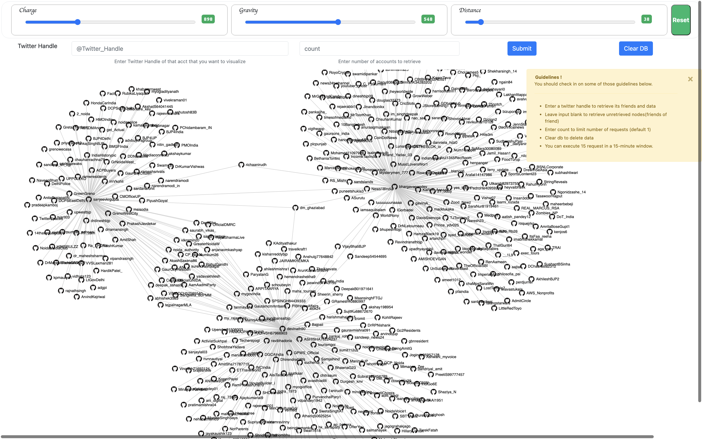
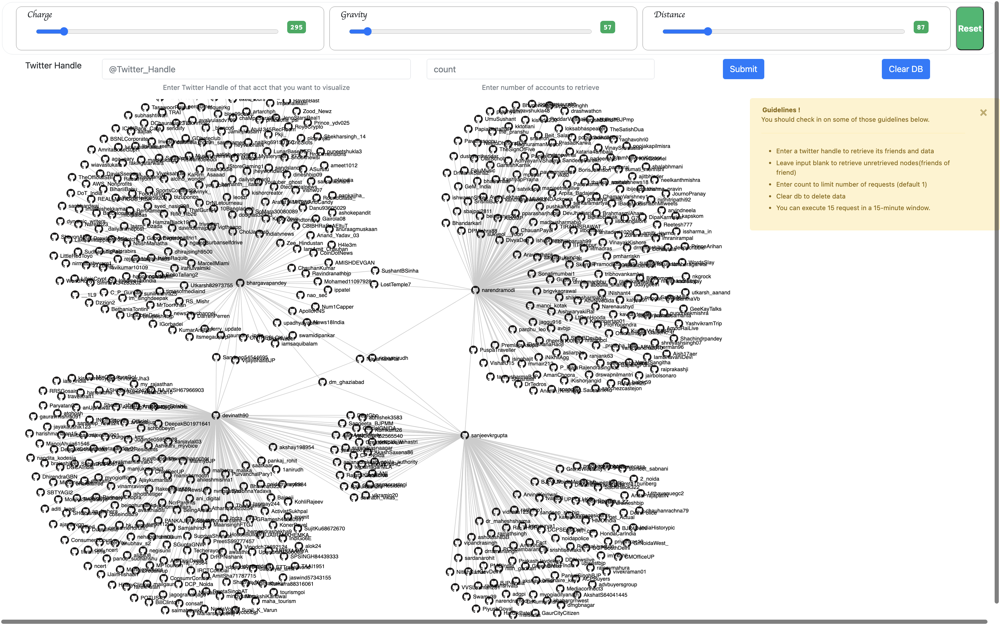
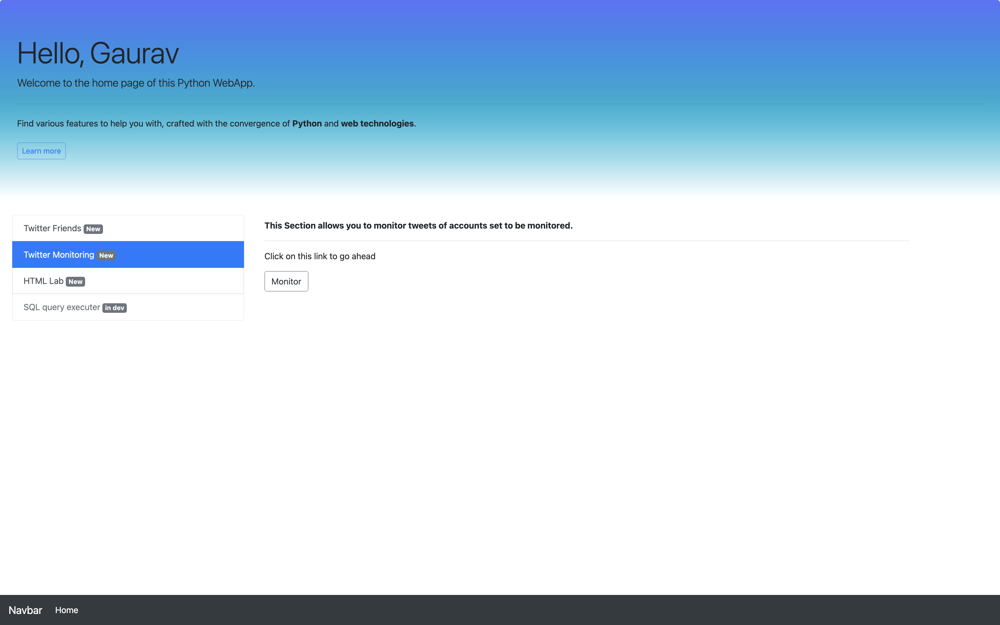
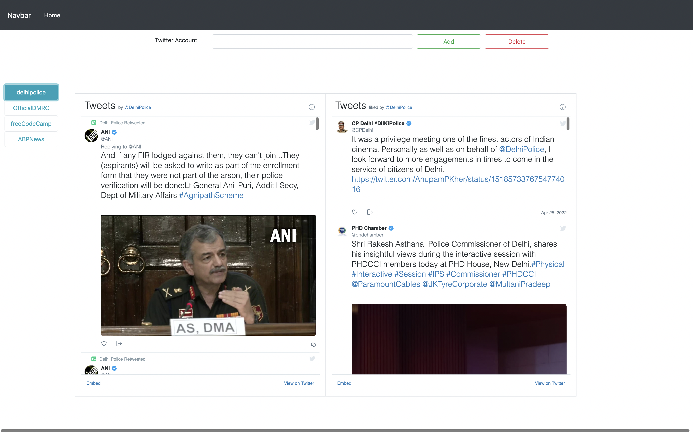
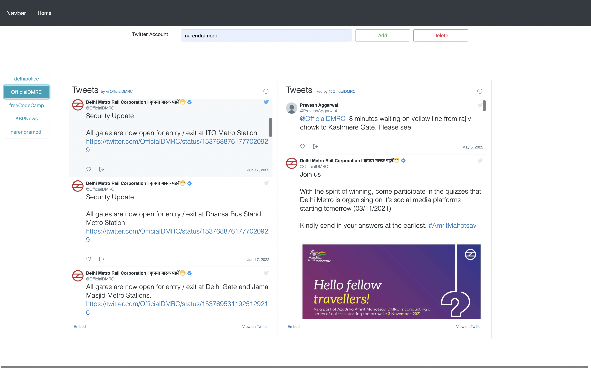
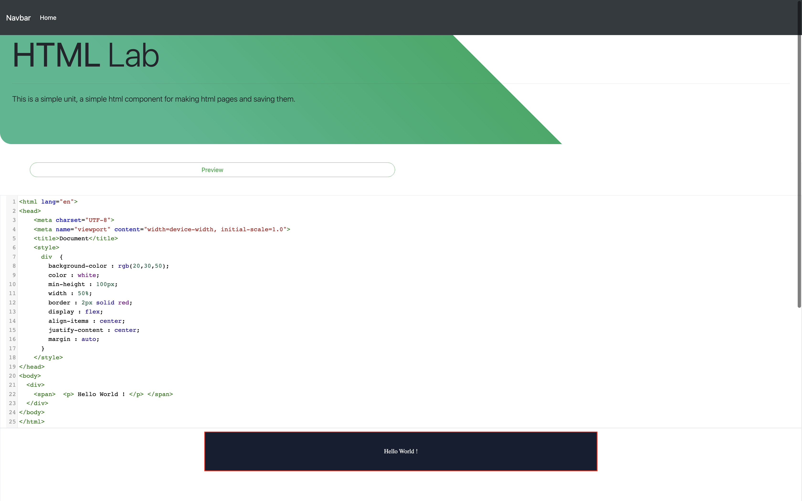

# WEB-APP-FOR-TWITTER-FRIENDS-ANALYSIS

Link : https://secret-falls-55277.herokuapp.com/

## Twitter Friends Visualization:

This feature allows to map a graph of your
friends and friends of friends or any their person having twitter account and creates a graph with common connection joined using edges and users as nodes.

## Twitter monitoring

This feature allows to add into database a group of twitter handles and allows to easily check their tweets without switching to their profile pages.

## HTML editor

This allows to create html pages using text editor and previews result in preview pane.

## __Screenshots__

 

## Sign in page

 
 

 

 

## Login page

 
 

 

 

## Home page

 
 

 

 

## Friends Visualization

 
 

 

 

## Profile Page 

 
 

 

 

## Monitoring Page

 
 

 

 

## HTML Editor

 
 

 

 